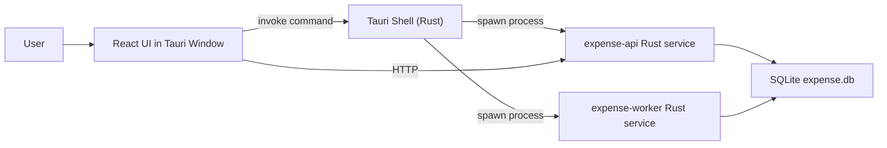

# Spendora

A desktop-first personal expense tracker built with:
- React UI (`apps/expense-desktop-ui`)
- Tauri desktop shell (`apps/expense-desktop-tauri`)
- Rust local services (`services/expense-rs`)
- SQLite local database (single-user, local-first)

This README explains the project as if desktop development is new to you.

## What This App Is
This is not a traditional "web app + remote server" architecture.
Instead, it is a desktop app that runs local services on your machine.

When the app starts:
1. Tauri opens a native desktop window.
2. React UI is loaded in that window.
3. The UI can ask Tauri to start local Rust services:
   - `expense-api` (HTTP API)
   - `expense-worker` (background worker)
4. Both services use the same local SQLite database.

## High-Level Architecture


## How Service Control Works
In the UI, there are 3 controls:
1. `Start Services`: Tauri spawns API and Worker via `cargo run -p api` and `cargo run -p worker`.
2. `Stop Services`: Tauri kills those child processes.
3. `Refresh Status`: Tauri checks whether child processes are alive.

## Repository Layout
- `apps/expense-desktop-ui`
  - React + Vite desktop UI.
- `apps/expense-desktop-tauri`
  - Native desktop shell.
  - Owns process lifecycle for API/Worker.
- `services/expense-rs`
  - Rust workspace containing:
    - `crates/api`: local HTTP API (`127.0.0.1:8081` by default)
    - `crates/worker`: background worker (`127.0.0.1:8082` health endpoint)
    - `crates/storage_sqlite`: DB connection + migration runner
    - `crates/core`: shared domain helpers/types
    - `crates/connectors_plaid`, `crates/connectors_manual`, `crates/agent`: stepwise feature modules
  - `migrations/0001_init.sql`: initial schema bootstrap
- `docs/expense`
  - runbooks, API contract stubs, testing docs.
- `tests/step1`
  - smoke tests and Step 1 test runner.

## First-Time Setup
### 1) Install prerequisites
- Node.js 20+
- Rust stable toolchain
- Tauri prerequisites for your OS

### 2) Install npm dependencies
```bash
npm install
```

### 3) Run desktop app in dev
```bash
npm run tauri:dev
```

Expected behavior:
1. Vite serves UI at `http://localhost:1420`.
2. Tauri opens desktop window.
3. Click `Start Services` in UI.
4. Status should show API + Worker running.

## Health Endpoints (When Running)
- API health: `http://127.0.0.1:8081/health`
- API diagnostics: `http://127.0.0.1:8081/api/v1/diagnostics`
- Worker health: `http://127.0.0.1:8082/health`

## Database Behavior
- SQLite file is created in OS app-data path (`SpendoraDesktop/expense.db`).
- On first API/Worker run with migration enabled, migrations are applied automatically.
- Current migration source: `services/expense-rs/migrations`.

## Test and Validation Commands
Run from repo root.

1. Rust tests
```bash
npm run test:rs
```

2. UI build validation
```bash
npm run test:ui-build
```

3. API/Worker smoke test
```bash
npm run test:step1:smoke
```

4. API/Worker stress-lite reliability test
```bash
npm run test:step1:stress
```

5. Full Step 1 suite
```bash
npm run test:step1
```

Manual desktop validation checklist:
- `tests/step1/tauri-manual-checklist.md`

Detailed test plan:
- `docs/expense/testing-step1.md`

## Common Troubleshooting
1. `icon ... is not RGBA`
- Ensure `apps/expense-desktop-tauri/src-tauri/icons/icon.png` exists and is RGBA PNG.

2. `frontendDist path doesn't exist`
- Ensure `apps/expense-desktop-ui/dist/index.html` exists (placeholder committed) or run `npm run ui:build`.

3. `failed to start api: No such file or directory`
- Ensure the services workspace exists at `services/expense-rs`.
- Restart `npm run tauri:dev` after path/config changes.

4. Rust dependency download errors
- If network/DNS blocks crates.io, Rust compile/test commands will fail until connectivity is available.

## Development Principles
Agent behavior rules are defined in:
- `agent.md`

Core project implementation plan is documented in:
- `docs/desktop-rust-plan.md`

Deep technical notes for Rust/Tauri/backend internals:
- `docs/DEVELOPER_NOTES.md`
