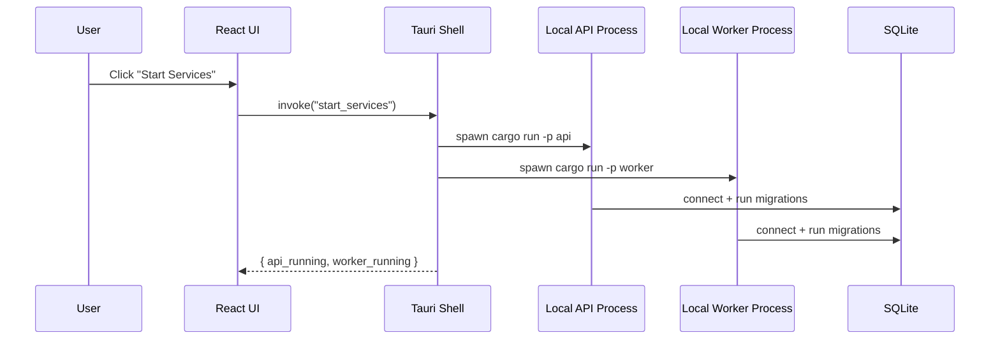

# Developer Notes (Tauri + Rust Deep Dive)

This document explains the technical architecture of this repository for a developer who knows Java/React but is new to Rust and desktop app internals.

## 1) What This App Actually Is

This project is a desktop application, not a browser-hosted web app.

Runtime pieces:
1. Tauri desktop shell (Rust) -> native app window and OS integration
2. React UI -> runs inside the Tauri window
3. Local Rust API service -> HTTP interface on localhost
4. Local Rust worker service -> background processing loop
5. SQLite database file -> local persistent storage

You can think of it like this:
- Tauri is the host/container process.
- API and Worker are child backend processes.
- UI talks to API over HTTP.
- Tauri controls process lifecycle.

## 2) Why Have Local API/Worker Processes at All?

You could ask: "Why not put all Rust logic inside Tauri commands and call that directly from UI?"

Valid question. We use separate local processes because:
1. Separation of concerns
- UI shell concerns stay in Tauri.
- Domain/backend concerns live in service crates.

2. Fault isolation
- If worker crashes, desktop UI can stay alive.
- If API restarts, worker can continue independently.

3. Better scalability path
- The same API contracts can later run remotely with minimal UI changes.
- Same patterns support eventual multi-user/cloud migration.

4. Operational clarity
- API has explicit endpoints and health checks.
- Worker has explicit lifecycle and logs.

5. Background processing model
- Worker loop is naturally process-oriented (polling jobs, retries, backoff).

Short answer: this design intentionally mimics production service boundaries while still being local-first.

## 3) Rust Concepts You Need First

## 3.1 What is a crate?
In Rust, a crate is the compilation unit/package.
- Binary crate: produces an executable (`main.rs`), like `api`, `worker`, `expense-desktop-tauri`.
- Library crate: reusable code (`lib.rs`), like `expense_core`, `storage_sqlite`.

Comparable Java view:
- Crate ~ Maven/Gradle module + artifact.

## 3.2 What is a Cargo workspace?
A workspace groups multiple crates with one top-level `Cargo.toml`.
- Shared dependency versions
- Unified build/test commands
- Clear module boundaries

Here:
- Workspace root: `services/expense-rs/Cargo.toml`
- Members: `crates/core`, `crates/storage_sqlite`, `crates/api`, etc.

## 3.3 Modules vs crates
- Module (`mod`) is an internal namespace inside a crate.
- Crate is a package boundary.

Use crates when boundaries are architectural/release-level.
Use modules when boundaries are internal organization.

## 3.4 Ownership and borrowing (very short practical view)
Rust enforces memory safety at compile-time:
- One owner per value
- Borrow by reference (`&T`) without transfer
- Mutable borrow (`&mut T`) is exclusive

Why you care here:
- Prevents many runtime bugs (null/ref races/use-after-free)
- Makes process/state handling explicit

## 3.5 Error handling
Rust uses `Result<T, E>` instead of exceptions for normal error flow.
- `?` propagates errors up cleanly
- `anyhow::Result` used at app edges for simpler error plumbing

Comparable Java view:
- Like checked exceptions + explicit return types, but stronger compile guarantees.

## 3.6 Async runtime
This repo uses `tokio`.
- `#[tokio::main]` sets up async runtime.
- API/worker do non-blocking IO (HTTP, DB, timers).

## 4) Repository Technical Map

## 4.1 Desktop side
- `apps/expense-desktop-tauri/src-tauri/src/main.rs`
  - Tauri app entrypoint
  - Registers commands callable from UI
  - Starts/stops child API/worker processes

## 4.2 Backend side
- `services/expense-rs/crates/api/src/main.rs`
  - Local HTTP server (Axum)
- `services/expense-rs/crates/worker/src/main.rs`
  - Background loop + health endpoint
- `services/expense-rs/crates/storage_sqlite/src/lib.rs`
  - DB connect + migrations
- `services/expense-rs/crates/core/src/lib.rs`
  - Shared domain/base helpers

## 4.3 Data layer
- `services/expense-rs/migrations/0001_init.sql`
  - Initial schema

## 5) Desktop Runtime Flow (What Happens on Start)

## 6) Tauri Entry Point (Detailed)

File: `apps/expense-desktop-tauri/src-tauri/src/main.rs`

Key responsibilities:
1. `ProcessState`
- Holds child handles for API and Worker.
- Stored in `Mutex` because commands can be invoked concurrently.

2. Tauri commands
- `start_services`
  - If process not alive, spawn it.
  - Return runtime status.
- `stop_services`
  - Kill/wait both children.
- `service_status`
  - Check child liveness via `try_wait`.

3. `services_root()` resolution
- Tries `EXPENSE_RS_ROOT` env var.
- Uses path from `CARGO_MANIFEST_DIR`.
- Has cwd fallback candidates.

Why this matters:
- In desktop apps, working directory is not always what you expect.
- Path resolution must be defensive.

4. `spawn_service(package)`
- Runs `cargo run -p <package>` in backend workspace directory.
- Uses inherited stdout/stderr for dev debugging.

## 7) API Startup Flow (Detailed)

File: `services/expense-rs/crates/api/src/main.rs`

Startup steps:
1. Parse CLI args (`clap`)
- `--db-path`
- `--port` (default 8081)
- `--migrate` (default true)

2. Initialize tracing/logging
- Uses `tracing_subscriber` with env filter.

3. Connect to SQLite
- Calls `storage_sqlite::connect`.

4. Run migrations (optional by flag)
- Calls `storage_sqlite::run_migrations`.

5. Build Axum router
- `/health`
- `/api/v1/health`
- `/api/v1/diagnostics`

6. Bind and serve
- Listens on `127.0.0.1:<port>`.

Important method behavior:
- `health()` returns shared `HealthStatus` from `expense_core`.
- `diagnostics()` executes `SELECT 1` to verify DB connectivity.

## 8) Worker Startup Flow (Detailed)

File: `services/expense-rs/crates/worker/src/main.rs`

Startup steps:
1. Parse args (`--db-path`, `--port`, `--poll-seconds`, `--migrate`).
2. Init tracing.
3. Connect DB and optionally migrate.
4. Spawn lightweight health HTTP server on worker port.
5. Start infinite heartbeat loop (`sleep(Duration::from_secs(...))`).

Why worker has HTTP health:
- External scripts/UI can verify liveness.
- Keeps operational model same as API.

## 9) SQLite Layer (Detailed)

File: `services/expense-rs/crates/storage_sqlite/src/lib.rs`

`connect(db_path)`:
1. Create parent dirs if missing.
2. Build SQLite URL `sqlite://...`.
3. Create SQLx pool.
4. Set `PRAGMA foreign_keys = ON`.

`run_migrations(pool)`:
- Executes SQL files in fixed order (currently includes `0001_init.sql`).
- Uses `CREATE TABLE IF NOT EXISTS` so reruns are idempotent.

Current critical tables include:
- `connections`, `accounts`, `transactions`, `job_runs`, `audit_events`, etc.

## 10) Core Crate Purpose

File: `services/expense-rs/crates/core/src/lib.rs`

Contains shared primitives:
- `HealthStatus` struct
- `DomainError` enum (base domain error taxonomy)
- `new_idempotency_key()` helper
- `default_app_data_dir()` resolver for OS-specific DB location

Why centralize this:
- Avoid duplicated cross-crate primitives
- Keep consistent behavior across API/worker

## 11) Build and Run Commands (What They Do)

From repo root:
1. `npm run tauri:dev`
- Starts UI dev server via Tauri config `beforeDevCommand`.
- Builds/runs Tauri shell.
- UI can invoke Tauri commands.

2. `npm run rs:api`
- Runs Rust API binary with migrations.

3. `npm run rs:worker`
- Runs Rust worker binary with migrations.

## 12) Managed Extraction Pipeline (Step 2.1)

New components:
1. `crates/connectors_ai`
- Contains managed extraction orchestration and provider clients.
- Provider order: `llamaparse` first, `openrouter_pdf_text` fallback.
- Retries are capped at 3 per provider.

2. `crates/storage_sqlite` additions
- `app_settings` table for extraction defaults.
- `imports` now stores extraction mode, effective provider, provider attempts, and diagnostics.

3. `crates/api` additions
- `GET/PUT /api/v1/settings/extraction`
- `POST /api/v1/imports` accepts optional extraction overrides.
- `GET /api/v1/imports/:id/status` returns extraction diagnostics fields.

4. `crates/worker` flow change
- CSV imports still use local parser.
- PDF imports route through extraction mode:
  - `managed`: providers with retry/fallback
  - `local_ocr`: stubbed not implemented error

## 13) Retry and Fallback Rules

Per provider:
1. Max attempts: 3
2. Retryable:
- timeout/network
- HTTP 429
- HTTP 5xx
3. Non-retryable:
- response schema invalid
- permanent 4xx client errors

Fallback:
- Only after primary provider stops/reaches limit.
- Final failure is surfaced as `MANAGED_ALL_PROVIDERS_FAILED`.

## 14) Logging Behavior

Worker logs include provider attempts and outcomes.
Additionally, provider responses are written to:
- `services/expense-rs/.runtime/logs/extraction-provider.log`

Each attempt log includes:
- import id
- provider name
- attempt number
- latency
- retry decision
- raw response (capped by configured max bytes)

This is intentionally verbose for diagnostics and includes sensitive data risk.

4. `npm run test:step1`
- Runs Rust tests, UI build validation, smoke tests.

## 12) Testing Strategy for Current Baseline

1. Rust unit tests
- `expense_core`: health/idempotency/path basics
- `storage_sqlite`: FK pragma + migration idempotency + table existence

2. Smoke tests (`tests/step1/smoke.sh`)
- Boots API and worker on test ports.
- Calls health/diagnostics endpoints.
- Verifies DB file and critical tables.

3. Manual Tauri checks
- `tests/step1/tauri-manual-checklist.md`
- Validates UI service control behavior.

## 13) Why Axum HTTP Instead of Tauri-only Commands?

Could we expose all backend functionality as Tauri commands? Yes.
Why not do only that:
1. HTTP contract is clearer and versionable (`/api/v1`).
2. UI can be tested against API independently.
3. Easier later migration to remote deployment.
4. Better separation between desktop shell concerns and backend domain concerns.

Tauri commands are used for process control; API handles business flows.

## 14) Typical Future Data Flow (When Features Expand)

Example future flow (Plaid sync):
1. UI calls API `/api/v1/connections/plaid/...`.
2. API validates/stores connection metadata.
3. API enqueues `job_runs` record.
4. Worker polls pending jobs and executes sync logic.
5. Worker writes normalized transactions.
6. UI reads updated transactions from API.

This matches service patterns you already know from web backend systems, but runs locally.

## 15) Rust Methodology Notes (Pragmatic)

For this repo, follow these practical Rust patterns:
1. Keep domain structs in library crates, not in binaries.
2. Keep `main.rs` thin: orchestration only.
3. Use `Result` and explicit error contexts (`anyhow::Context`).
4. Prefer immutable data; mutate only where needed.
5. Avoid giant functions; small composable functions are easier to test.
6. Keep side-effects at edges (I/O, process spawning, network, DB).
7. Use typed boundaries between layers (core -> storage/connectors -> api/worker).

## 16) Desktop-Specific Pitfalls to Remember

1. Path assumptions can break in packaged apps.
- Always resolve with explicit strategy; do not assume cwd.

2. Process lifecycle must be explicit.
- Start/stop/status logic should be deterministic.

3. Localhost ports can conflict.
- Keep ports configurable and report errors clearly.

4. Build-time assets are strict in Tauri.
- Icons and frontend dist path must exist and be valid.

## 17) Quick Glossary (Rust + Tauri)

1. Crate: Rust package/compilation unit.
2. Workspace: group of crates with shared dependency config.
3. Binary crate: executable target (`main.rs`).
4. Library crate: reusable code (`lib.rs`).
5. Trait: Rust interface/behavior contract.
6. Macro: code generation/expansion mechanism.
7. Proc macro: compile-time macro used by frameworks (like Tauri context generation).
8. Axum: async Rust web framework.
9. SQLx: async DB toolkit with compile/runtime query support.
10. Tauri command: Rust function callable from frontend via invoke.

## 18) Recommended Learning Path for This Repo

1. Read Tauri command code first:
- `apps/expense-desktop-tauri/src-tauri/src/main.rs`

2. Read API startup next:
- `services/expense-rs/crates/api/src/main.rs`

3. Read storage layer next:
- `services/expense-rs/crates/storage_sqlite/src/lib.rs`

4. Read worker runtime:
- `services/expense-rs/crates/worker/src/main.rs`

5. Run tests and smoke scripts:
- `npm run test:step1`

This order gives fastest system-level understanding.
