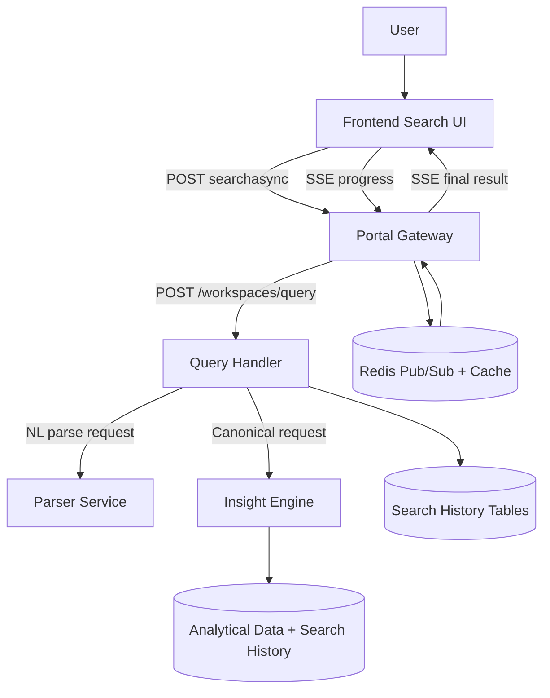
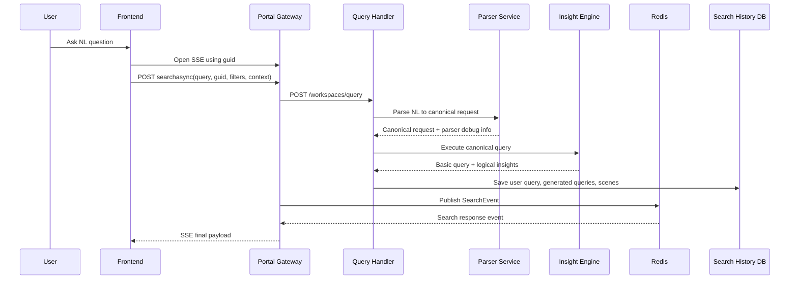
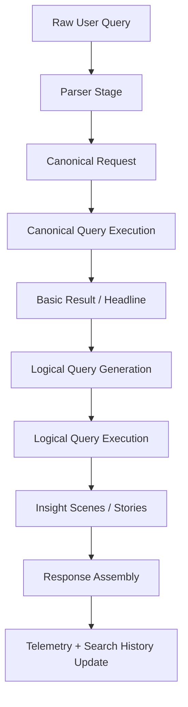
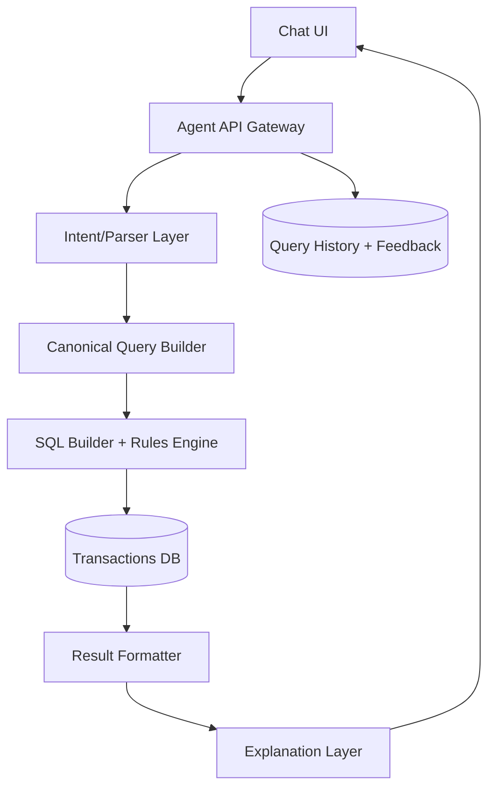
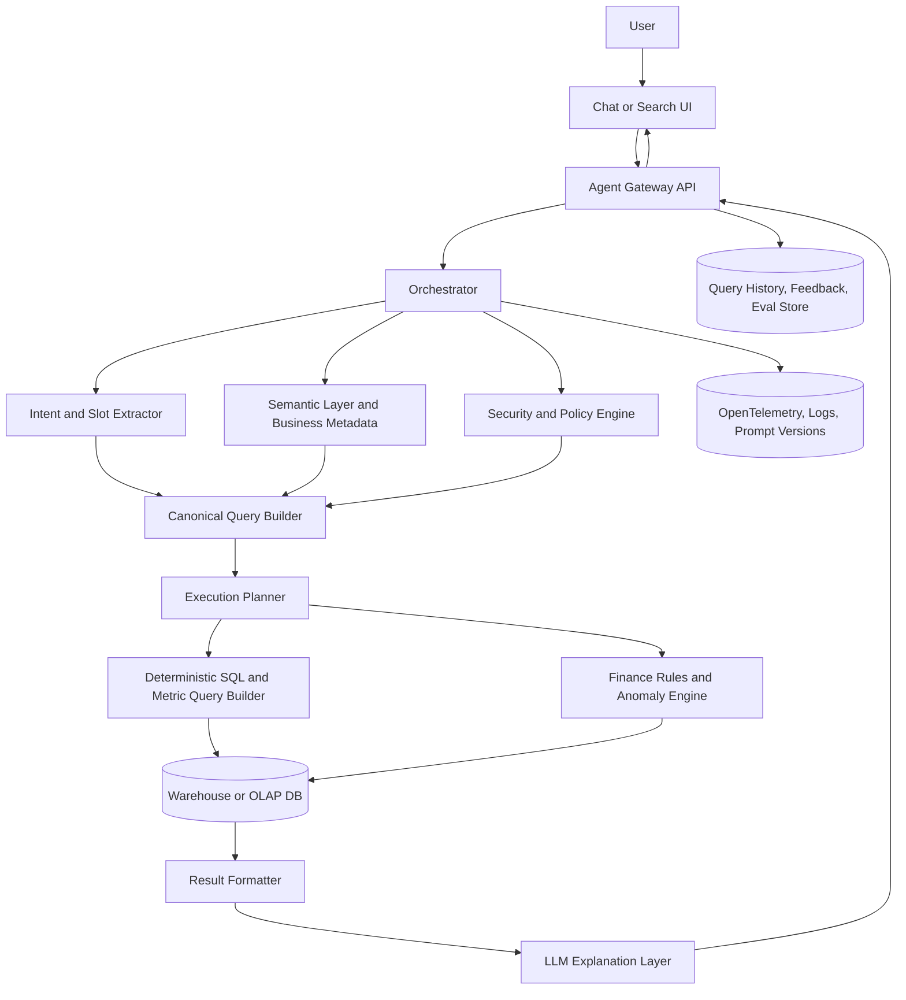
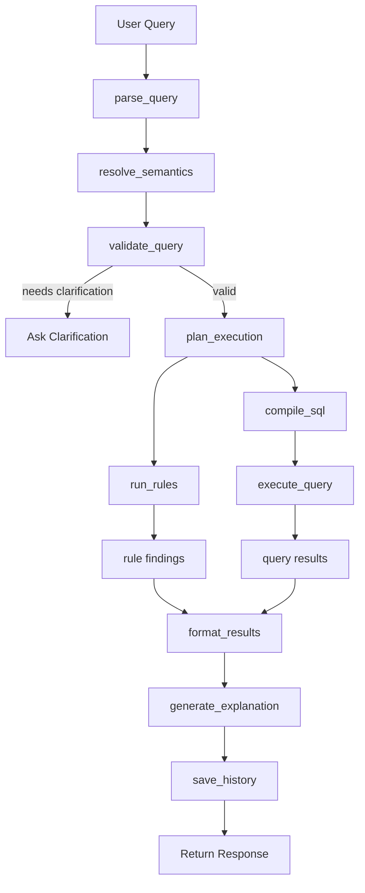
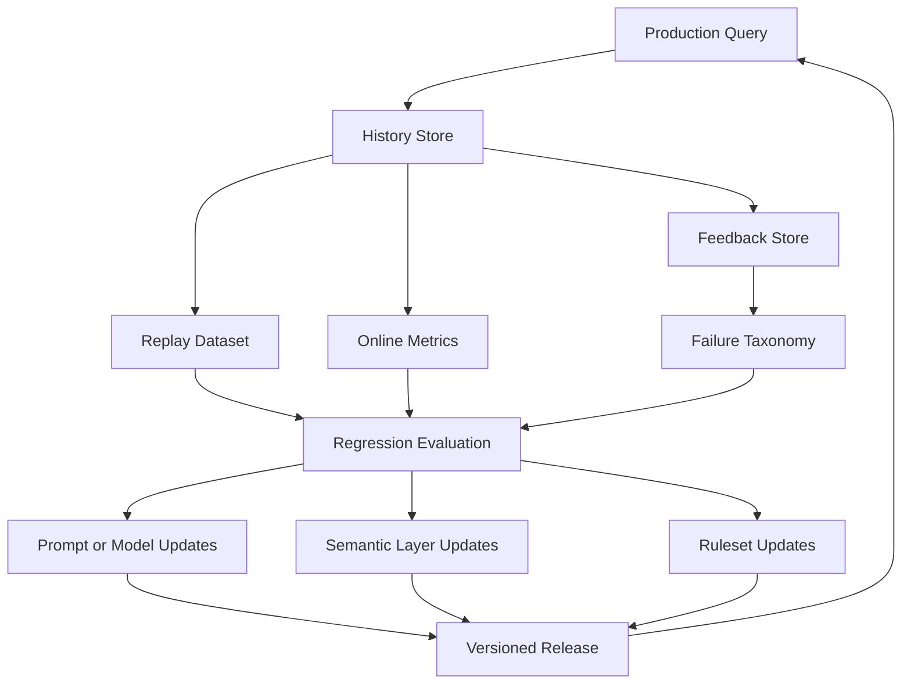

# Natural Language Financial Agent Architecture Report

## Index

- [Purpose](#purpose)
- [Executive Summary](#executive-summary)
- [Figure 1. High-Level System Architecture](#figure-1-high-level-system-architecture)
- [Figure 2. Request Lifecycle](#figure-2-request-lifecycle)
- [Figure 3. Internal Processing Stages](#figure-3-internal-processing-stages)
- [Observed Architecture In This Codebase](#observed-architecture-in-this-codebase)
- [What The System Is Actually Doing Conceptually](#what-the-system-is-actually-doing-conceptually)
- [What You Should Reuse In Your Finance Agent](#what-you-should-reuse-in-your-finance-agent)
- [Recommended Architecture For Your Project](#recommended-architecture-for-your-project)
- [How To Implement "Where Did I Spend Too Much This Month?"](#how-to-implement-where-did-i-spend-too-much-this-month)
- [Data Model Recommendations](#data-model-recommendations)
- [Why This Design Is Better Than A Single LLM Call](#why-this-design-is-better-than-a-single-llm-call)
- [Recommended Build Order For Your Project](#recommended-build-order-for-your-project)
- [Minimal Viable Intents For A Finance Agent](#minimal-viable-intents-for-a-finance-agent)
- [Final Recommendation](#final-recommendation)
- [Modern Ground-Up Rebuild Recommendations](#modern-ground-up-rebuild-recommendations)
- [Source Areas Used For This Report](#source-areas-used-for-this-report)

## Purpose

This report explains how the MachEye codebase implements natural-language querying over structured data, with emphasis on the parts that matter if you want to build a finance-focused agent that can answer questions such as:

- Where did I spend too much this month?
- Which categories are unusually high compared to last month?
- What subscriptions increased this quarter?

The goal is not to copy product behavior verbatim. The goal is to extract the architecture, contracts, and design patterns that make the feature work so you can implement the same capability in your own project.

## Executive Summary

MachEye implements natural-language querying as a staged pipeline rather than a single model call.

Core pattern:

1. The frontend submits a search request asynchronously and subscribes for progress/results.
2. A gateway service enriches the request with user, workspace, flags, filters, and a stable query UUID.
3. A query-handler service orchestrates the request through a parser stage and an execution stage.
4. The parser converts user text into a canonical machine-readable request.
5. The insight engine executes the canonical request against the workspace data and returns structured scenes/results.
6. Search history is persisted with detailed telemetry for later analytics, quality measurement, and feedback capture.
7. Results are pushed back to the UI via Redis pub/sub and SSE.

This is the main takeaway for your finance agent: do not treat NL query execution as one opaque prompt. Treat it as a traceable pipeline with explicit contracts, observability, and persistence.

## Figure 1. High-Level System Architecture



## Figure 2. Request Lifecycle



## Figure 3. Internal Processing Stages



## Observed Architecture In This Codebase

### 1. Frontend submission is async-first

The UI creates a request GUID, opens an SSE channel, then posts the query asynchronously. That prevents the browser from blocking on query execution and gives the system a correlation ID immediately.

Observed flow in code:

- `searchBox.js` creates `reqGuid`, connects SSE, then posts the search request.
- `api-endpoints-helper.js` defines `/workspaces/{wsId}/searchasync` and `/workspaces/{wsId}/searches/{guid}/progress`.
- `sseHelper.js` wraps the event source lifecycle.

Why this matters for your project:

- Finance questions can take longer when they require anomaly detection, comparison windows, merchant rollups, or category normalization.
- Async delivery gives you room for proper execution without building a fragile request timeout path.

### 2. The gateway enriches and normalizes the request

The portal service does not simply proxy the UI request. It enriches the payload with:

- workspace and organization context
- user identity
- source and device info
- filters and context
- query UUID
- flags such as `NO_SEARCH_HISTORY` or `NO_INSIGHTS`
- feature controls such as true NLP enablement and retry-with-LLM

This is the correct place to insert security and tenancy boundaries.

For your finance agent, this gateway layer should also attach:

- account scope
- allowed accounts or cards
- time zone
- currency
- user preferences
- data access policy

### 3. Query handling is a state machine, not a monolith

The query handler maintains internal states such as:

- parser
- canonical query
- create logical query
- logical query execution
- done

This is important because it gives the system structured transitions and precise error handling.

Why it matters for finance:

- You can fail parser understanding separately from SQL execution.
- You can support fallback behaviors such as alternate queries, simpler aggregates, or reduced intent scope.
- You can measure which stage causes poor answers.

### 4. Parser output is a canonical contract

The parser does not return final prose. It returns a canonical request that the next stages can execute.

That contract appears to include phaser/grouping/filter/intent/focus structures and parser debug metadata.

This is the most important reusable design choice for your implementation.

For finance, your canonical schema should capture at least:

- intent: overspend, compare, summarize, top merchants, recurring payments
- measures: amount, average daily spend, month-over-month delta
- dimensions: category, merchant, account, payment method
- time filters: this month, last month, trailing 90 days
- thresholds: above budget, above historical average, unusual increase
- grouping: by category, by merchant, by week
- ranking/sort: top increase, highest amount, largest variance

Example canonical form for your use case:

```json
{
  "intent": "overspend_detection",
  "measure": "sum(amount)",
  "groupBy": ["category"],
  "timeRange": {
    "type": "current_month"
  },
  "comparison": {
    "baseline": "previous_3_month_average"
  },
  "sortBy": "variance_desc",
  "limit": 10
}
```

### 5. Execution is split into canonical and logical phases

MachEye distinguishes between:

- canonical query execution for the main interpretation
- logical query execution for derived insights and story scenes

This lets the system produce both:

- the primary answer
- supporting views or related insight slices

For a finance agent, this maps cleanly to:

- primary answer: categories where spend is unusually high this month
- supporting logical queries:
  - merchant breakdown inside those categories
  - comparison vs prior month
  - recurring charges that changed
  - daily spike analysis

### 6. Search history is a first-class subsystem

The code persists query telemetry into dedicated search history tables rather than relying only on logs.

Observed responsibilities include:

- storing the user query and query UUID
- parser tokens and parser performance
- response codes and processing times
- canonical/generated query records
- scenes and derived outputs

This is a strong design choice and one you should copy.

For your project, a minimum query history row should include:

- query_uuid
- user_id
- workspace_id or tenant_id
- raw_user_query
- canonical_query_json
- generated_sql
- query_status
- answer_summary
- processing_time_ms
- parser_confidence
- created_at
- feedback_rating
- feedback_notes

## What The System Is Actually Doing Conceptually

At a conceptual level, the pipeline is:

1. Understand the question.
2. Translate the question into structured semantics.
3. Compile those semantics into executable data operations.
4. Execute against data.
5. Package the result into UI-ready structures.
6. Persist telemetry and later user feedback.

That is a classic NL-to-data architecture, but here it is implemented with strong operational boundaries between each stage.

## What You Should Reuse In Your Finance Agent

### Reuse Pattern A. Stable query UUID from the first hop

Every question should get a UUID immediately. Use that UUID across:

- gateway request
- parser call
- execution call
- async UI correlation
- persisted query history
- feedback updates

This is critical for debugging and analytics.

### Reuse Pattern B. Canonical intermediate representation

Do not let the frontend, parser, and executor speak in ad hoc fields.

Use a single canonical query model. It should be the system of record for the question interpretation.

### Reuse Pattern C. Distinct parser and executor services

Even if they live in one codebase initially, keep them logically separate.

Reason:

- parser errors are not data errors
- SQL generation is not answer ranking
- you will want to improve one stage without destabilizing the others

### Reuse Pattern D. Persist query diagnostics explicitly

The MachEye implementation stores parser token info, performance, response codes, statuses, and generated query metadata.

That is exactly how you later answer questions such as:

- which intents fail most often?
- which parser patterns lead to bad financial answers?
- what categories of user questions need retraining?

### Reuse Pattern E. Feedback belongs on the query record

The repo analysis for DI-13625 points to query-level feedback keyed by `queryUuid` as the right design.

That is also the right model for your finance agent:

- a thumbs-up means the answer was useful
- a thumbs-down means interpretation, data, or explanation failed

If you later want more detail, add:

- wrong category grouping
- missed merchant normalization
- wrong time range
- explanation not clear
- anomaly threshold not useful

## Recommended Architecture For Your Project

## Figure 4. Suggested Finance Agent Design



### Suggested service responsibilities

#### UI / Chat layer

- accepts free-text questions
- shows async progress
- renders tables, charts, and concise natural-language summaries
- captures thumbs up/down

#### Gateway / Agent API

- auth, tenant scoping, account scope
- request UUID generation
- query history row creation
- orchestration and retries

#### Parser / Intent layer

- maps NL text to intent and slots
- resolves time phrases and category phrases
- normalizes merchant/category aliases

#### Canonical query builder

- produces strict executable representation
- validates required slots
- returns confidence and unresolved ambiguities

#### SQL builder + rules engine

- compiles canonical query to SQL
- applies business logic such as overspend thresholds, budget comparisons, monthly rollups, and anomaly windows

#### Explanation layer

- converts result rows into short user-friendly summaries
- explains why something is considered overspend

## How To Implement "Where Did I Spend Too Much This Month?"

This specific question is not just a sum query. It implies a comparison baseline.

A robust implementation should resolve it as:

- current month spend by category or merchant
- compared against one or more baselines:
  - previous month
  - trailing 3-month average
  - user budget
  - peer period for seasonality if needed

Suggested algorithm:

1. Detect intent `overspend_detection`.
2. Default time range to current month.
3. Default grouping to category first.
4. Compute `current_spend`, `baseline_spend`, `delta`, `delta_pct`.
5. Filter to rows where delta or delta_pct exceeds threshold.
6. Rank descending by abnormality score.
7. Return top findings and supporting evidence.

Example result payload:

```json
{
  "queryUuid": "3f1d4d7a-4dcb-4cf0-a9c4-cbdb16d8e101",
  "intent": "overspend_detection",
  "summary": "You spent significantly more on Dining, Travel, and Ride Share this month.",
  "findings": [
    {
      "group": "Dining",
      "current": 842.10,
      "baseline": 410.32,
      "delta": 431.78,
      "deltaPct": 105.2
    }
  ]
}
```

## Data Model Recommendations

### Core transaction table

```text
transactions(
  id,
  user_id,
  account_id,
  posted_at,
  amount,
  currency,
  merchant_name,
  normalized_merchant,
  category,
  subcategory,
  is_recurring,
  metadata_json
)
```

### Query history table

```text
query_history(
  id,
  query_uuid,
  user_id,
  tenant_id,
  raw_query,
  canonical_query_json,
  generated_sql,
  query_status,
  parser_confidence,
  answer_summary,
  processing_time_ms,
  created_at,
  feedback_rating,
  feedback_text,
  feedback_at
)
```

### Optional findings table

```text
query_findings(
  id,
  query_uuid,
  finding_type,
  entity_name,
  current_value,
  baseline_value,
  delta_value,
  delta_pct,
  rank,
  payload_json
)
```

## Why This Design Is Better Than A Single LLM Call

If you answer financial questions by sending raw data and a prompt to one model call, you will eventually hit these problems:

- inconsistent interpretation of time ranges
- weak reproducibility
- no reliable audit trail
- no deterministic SQL or rules execution
- poor debugging when answers are wrong
- no good analytics on failure patterns

The MachEye pattern avoids that by separating:

- understanding
- execution
- explanation
- telemetry

That is the right approach for finance and any user-facing data assistant.

## Recommended Build Order For Your Project

1. Create query history and feedback tables.
2. Add gateway API that assigns `query_uuid` and persists the initial row.
3. Build a parser that outputs canonical JSON.
4. Build deterministic SQL generation for 3 to 5 intents only.
5. Add async response delivery.
6. Add explanation summarization over structured result rows.
7. Add thumbs feedback keyed by `query_uuid`.
8. Add analytics dashboards over query history.

## Minimal Viable Intents For A Finance Agent

Start with a narrow set:

1. spend_summary
2. overspend_detection
3. compare_periods
4. top_merchants
5. recurring_charge_changes

That is enough to deliver clear value before you attempt broader conversational finance support.

## Final Recommendation

The main thing to copy from this project is not any single endpoint. It is the architecture:

- async UI + correlation ID
- gateway enrichment
- parser to canonical contract
- deterministic execution pipeline
- query history as a first-class product surface
- feedback tied to query UUID

If you implement those pieces cleanly, you can support finance questions such as "Where did I spend too much this month?" in a way that is debuggable, measurable, and safe to iterate on.

## Modern Ground-Up Rebuild Recommendations

This section extends the earlier architecture analysis with a ground-up modernization plan based on current AI-native design patterns, model capabilities, evaluation practices, and finance-specific safety requirements.

### Modernization Index

- [Short Answer](#short-answer)
- [What Was Good In The Old Architecture And Should Be Kept](#what-was-good-in-the-old-architecture-and-should-be-kept)
- [What Is Outdated And Should Be Replaced Or Modernized](#what-is-outdated-and-should-be-replaced-or-modernized)
- [Recommended Modern Architecture](#recommended-modern-architecture)
- [The Biggest Architectural Upgrade: Add A Semantic Layer](#the-biggest-architectural-upgrade-add-a-semantic-layer)
- [Use Modern Model Patterns, Not One Model For Everything](#use-modern-model-patterns-not-one-model-for-everything)
- [Replace Free-Form Parsing With Structured Outputs](#replace-free-form-parsing-with-structured-outputs)
- [Introduce Explicit Clarification Loops](#introduce-explicit-clarification-loops)
- [Upgrade Execution With A Planner, But Keep It Bounded](#upgrade-execution-with-a-planner-but-keep-it-bounded)
- [Modernize Overspend And Anomaly Detection](#modernize-overspend-and-anomaly-detection)
- [Add A Narrative Layer That Explains Why](#add-a-narrative-layer-that-explains-why)
- [Add Conversation Memory, But Keep It Structured](#add-conversation-memory-but-keep-it-structured)
- [Evaluation Must Be A First-Class Subsystem](#evaluation-must-be-a-first-class-subsystem)
- [Add Prompt, Model, And Config Versioning](#add-prompt-model-and-config-versioning)
- [Build For Observability From The Start](#build-for-observability-from-the-start)
- [Privacy And Security Should Be Stricter Than Before](#privacy-and-security-should-be-stricter-than-before)
- [Suggested Modern Tech Stack](#suggested-modern-tech-stack)
- [Modern Methodologies To Adopt](#modern-methodologies-to-adopt)
- [Example Modern End-To-End Flow](#example-modern-end-to-end-flow)
- [What I Would Build Differently From Scratch](#what-i-would-build-differently-from-scratch)
- [Suggested Phased Build Plan](#suggested-phased-build-plan)
- [Practical Latest-Tech Recommendations](#practical-latest-tech-recommendations)
- [Strongest Recommendation](#strongest-recommendation)
- [Final Modern Recommendation](#final-modern-recommendation)
- [Old Vs Modern Comparison Table](#old-vs-modern-comparison-table)
- [Canonical Finance Query Schema Design](#canonical-finance-query-schema-design)
- [Bounded Tooling And Agent Contract](#bounded-tooling-and-agent-contract)
- [Evaluation And Feedback Loop Design](#evaluation-and-feedback-loop-design)
- [Runtime And Deployment Topology](#runtime-and-deployment-topology)
- [Semantic Layer And Metadata Lifecycle](#semantic-layer-and-metadata-lifecycle)
- [RAG Usage Guidance For Finance Agents](#rag-usage-guidance-for-finance-agents)
- [Non-Functional Requirements And SLO Targets](#non-functional-requirements-and-slo-targets)
- [Production Guardrails Checklist](#production-guardrails-checklist)
- [Detailed Delivery Roadmap](#detailed-delivery-roadmap)

### Short Answer

The best upgrade is not replacing the old pipeline with a single LLM call.

The best upgrade is to keep the pipeline discipline MachEye already had, but rebuild each stage with modern AI-native patterns.

The three most important modernization moves are:

1. LLM-assisted parsing, not LLM-only answering.
2. Schema-first canonical query contracts with deterministic execution.
3. Evaluation, observability, and feedback as first-class product features.

### What Was Good In The Old Architecture And Should Be Kept

The original system already had several strong design choices that are still correct today:

- async request lifecycle
- stable query UUID
- parser to canonical form to execution pipeline
- telemetry and search history persistence
- multi-stage processing instead of one opaque model call

Those ideas should remain the foundation of your project.

Keep these core concepts:

- query UUID from the first hop
- separation between understanding and execution
- persistence of intermediate artifacts
- retries and bounded fallbacks
- feedback attached to the query record

### What Is Outdated And Should Be Replaced Or Modernized

An older NL system often shows its age in these areas:

- parser logic that is hard to evolve
- weak model routing and orchestration
- limited support for conversational follow-ups
- insufficient evaluation discipline
- limited grounding against business metadata
- weaker observability for prompt and model changes

Today, these parts should be rebuilt with structured outputs, semantic modeling, bounded tool use, and explicit evaluation.

### Recommended Modern Architecture

## Figure 5. Modern AI-Native Finance Agent Architecture



This architecture keeps the staged pipeline but modernizes the inner layers.

### The Biggest Architectural Upgrade: Add A Semantic Layer

One of the most important improvements is introducing a semantic layer between user language and raw SQL.

Instead of letting the model reason directly over table and column names, define business concepts such as:

- measures: `total_spend`, `avg_monthly_spend`, `recurring_spend`, `spend_delta_pct`
- dimensions: `category`, `merchant`, `account`, `payment_method`, `month`
- derived concepts: `overspend`, `budget_variance`, `abnormal_increase`, `recurring_charge_change`

This changes the path from:

- natural language to raw SQL

to:

- natural language to semantic intent to canonical business query to SQL

This gives you better reliability, clearer explanations, easier testing, and much safer finance logic.

### Use Modern Model Patterns, Not One Model For Everything

Use model specialization rather than a single model for all stages.

Recommended model roles:

- a small fast router for intent detection and routing
- a stronger reasoning model for structured parsing, ambiguity handling, and explanation generation
- an embedding model for merchant alias resolution, category synonym mapping, and retrieval over finance metadata or policy docs

Example routing strategy:

- a simple request like "top merchants this month" should take a fast path
- a more complex request like "why is my travel spend unusually high compared to seasonal norm" should take a stronger reasoning path

This lowers both latency and cost.

### Replace Free-Form Parsing With Structured Outputs

This is one of the most valuable modern upgrades.

Instead of letting the model emit open-ended text, require a structured schema for the parse result.

Example:

```json
{
  "intent": "overspend_detection",
  "entities": {
    "group_by": ["category"],
    "measure": "total_spend"
  },
  "time_range": {
    "type": "relative",
    "value": "this_month"
  },
  "comparison": {
    "baseline": "previous_3_month_average"
  },
  "filters": [],
  "sort": {
    "field": "delta_pct",
    "direction": "desc"
  },
  "limit": 10,
  "confidence": 0.91,
  "needs_clarification": false
}
```

Then validate this with:

- JSON schema or Pydantic
- enum and field constraints
- business rule validation
- safe defaults where allowed

This improves reproducibility, testability, versioning, and hallucination resistance.

### Introduce Explicit Clarification Loops

Modern systems should know when not to guess.

Example:

If a user asks, "Where did I spend too much?", the system should detect missing scope such as:

- time range
- grouping level
- comparison baseline

If confidence is low, the system should ask a clarification question instead of returning a potentially wrong answer.

For example:

"Do you want me to compare against your budget, last month, or your 3-month average?"

Recommended rule:

- if parser confidence is below threshold
- or multiple interpretations compete
- or required slots are missing

then enter clarification state and do not execute the final query yet.

### Upgrade Execution With A Planner, But Keep It Bounded

Modern agentic orchestration is useful, but for finance it must be bounded.

Good pattern:

- let an orchestrator choose among fixed tools such as parse query, retrieve semantic definitions, build canonical query, compile SQL, run anomaly analysis, generate explanation, and save history

Bad pattern:

- letting a model invent tools, SQL, and business logic with no validation

For finance, use a bounded agent with:

- fixed tool set
- validated input and output schemas
- policy checks
- deterministic execution beneath the orchestration layer

### Modernize Overspend And Anomaly Detection

Your finance agent can be materially better than the older pipeline if it upgrades anomaly handling.

Use a layered anomaly strategy:

#### Layer 1: Deterministic business heuristics

- compare current month to previous month
- compare current month to trailing 3-month average
- compare against budget
- detect recurring increase over threshold
- detect category spike over threshold

#### Layer 2: Statistical anomaly detection

- rolling z-score
- median absolute deviation and other robust outlier methods
- seasonal decomposition when history is sufficient
- peer-period comparison

#### Layer 3: Personalized ML baselines

If you have enough user history, add:

- personalized expected spend models
- merchant recurrence models
- change-point detection
- seasonality-aware category baselines

The practical recommendation is to start with rules plus robust statistics, then add personalized ML later.

### Add A Narrative Layer That Explains Why

Users want more than numbers. They want explanations.

Each result should contain:

- the finding
- the evidence
- the baseline used
- the reason the item was flagged
- a confidence level
- a suggested follow-up

Example:

"Dining spend is 105% above your trailing 3-month average. Most of the increase came from six transactions at three restaurants, especially during the last two weekends."

This explanation should be generated from structured outputs, not from raw unrestricted transaction dumps.

### Add Conversation Memory, But Keep It Structured

A modern finance agent should support follow-up questions like:

- what about by merchant
- only on my Chase card
- show me last quarter instead
- was that mostly subscriptions

Do not rely only on hidden chat memory. Persist structured conversational state such as:

- current session context
- last canonical query
- current filters
- selected accounts
- current baseline and time range

That lets follow-up questions transform the previous canonical query safely.

### Evaluation Must Be A First-Class Subsystem

This is one of the largest gaps between older NL systems and strong modern AI products.

Build evaluation in from day one.

#### Offline evals

Create a benchmark set of finance questions for:

- spend summary
- compare periods
- recurring changes
- top merchants
- anomalies
- ambiguous prompts
- adversarial prompts

For each case, store:

- expected canonical query
- expected SQL or semantic query
- expected answer shape
- expected explanation quality

#### Online evals

Track:

- clarification rate
- execution success rate
- thumbs-up or acceptance rate
- thumbs-down rate by intent
- hallucination incidents
- time to first token
- total latency
- cost per successful answer

#### LLM-as-judge

This can help, but should not be trusted alone. Combine it with:

- rule-based correctness checks
- gold datasets
- user feedback
- sampled manual review

### Add Prompt, Model, And Config Versioning

Version all critical artifacts, including:

- parse prompt
- explanation prompt
- canonical schema version
- semantic model version
- anomaly thresholds
- SQL templates
- fallback policies

Store these against each query record so you can trace quality regressions.

Example fields:

- `parser_version`
- `prompt_version`
- `semantic_model_version`
- `ruleset_version`
- `model_name`

### Build For Observability From The Start

Capture per-query telemetry such as:

- request UUID
- user, session, and tenant
- model used
- tokens used
- latency per stage
- parser output
- validation errors
- SQL generated
- rows scanned
- result size
- explanation prompt version
- feedback signals

Use OpenTelemetry, structured logs, distributed tracing, and cost dashboards.

### Privacy And Security Should Be Stricter Than Before

For finance, modernization also means stronger safety.

Add controls for:

- tenant isolation
- row-level security
- account-level policy checks
- PII minimization before model calls
- masking of merchant and payment details when needed
- model input redaction
- audit logs for every query
- allowlist-based tool access
- prompt injection defenses for retrieved content

Important rule:

Never send unrestricted raw transaction history to a model if deterministic systems can answer the question.

Prefer:

- structured aggregates
- masked rows
- summarized evidence
- semantic metadata

The model should orchestrate and explain, not become the database.

### Suggested Modern Tech Stack

Recommended technology choices for a current implementation:

#### Backend

- FastAPI or Spring Boot for the gateway and orchestrator
- Python for AI orchestration and finance analytics if your team is comfortable with it
- Temporal or Celery for long-running workflows
- Kafka or Redis Streams for evented async paths when needed

#### Data

- Postgres for app data, query history, and feedback
- ClickHouse, DuckDB, Snowflake, or BigQuery for analytical execution
- dbt for semantic and business transformation layers

#### AI orchestration

- model provider abstraction
- structured output validation with Pydantic
- prompt and version registry
- evaluation framework
- retrieval only over trusted metadata and policy documents

#### Frontend

- React or Next.js
- streaming UI
- clarification chips
- evidence drill-down
- partial results and progressive explanations

#### Observability

- OpenTelemetry
- Grafana, Datadog, or Honeycomb
- token and cost dashboards

### Modern Methodologies To Adopt

Recommended working practices:

#### AI product development should be eval-driven

- define benchmark queries before broad rollout
- define expected canonical outputs
- score each release

#### Use contract-first design

Define these before implementation:

- canonical query schema
- tool input and output schemas
- explanation payload schema
- feedback schema

#### Use narrow-intent rollout

Do not launch with "ask anything about your finances."

Start with a bounded set:

1. spend summary
2. compare periods
3. overspend detection
4. top merchants
5. recurring charge changes

#### Prefer deterministic execution over generative execution

Models should primarily:

- interpret
- clarify
- explain

They should not be the authority for finance calculations.

#### Build human-in-the-loop review

Regularly review:

- failed queries
- low-confidence queries
- negative feedback samples
- high-cost queries
- unexpected model behavior

### Example Modern End-To-End Flow

For the request "Where did I spend too much this month?" a modern flow would be:

1. UI sends the question and creates `query_uuid`.
2. Gateway stores an initial query record.
3. Router classifies likely intent as `overspend_detection`.
4. LLM parser returns a structured JSON parse.
5. Validator checks required slots and ambiguity.
6. Semantic layer maps "spend too much" to an overspend policy and default baseline.
7. Planner chooses spend aggregate query, baseline query, and anomaly scoring rule.
8. SQL and rules engine execute deterministically.
9. Formatter creates ranked findings.
10. Explanation layer generates a grounded summary.
11. Response streams back to UI.
12. Query history stores canonical query, SQL, findings, model versions, latency, and cost.
13. User feedback attaches to the same `query_uuid`.

### What I Would Build Differently From Scratch

If rebuilding from scratch today, I would separate the system into these explicit layers:

- interaction layer for chat and search UI
- orchestration layer for session state, routing, and policy
- understanding layer for structured parsing and finance lexicon resolution
- semantic contract layer for business metrics, dimensions, and supported intents
- deterministic execution layer for SQL, finance rules, and anomaly logic
- grounded explanation layer for natural-language summaries tied to evidence
- quality platform for history, feedback, replay, and evaluation

### Suggested Phased Build Plan

#### Phase 1: Foundation

- canonical schema
- query UUID
- query history table
- async API
- tracing

#### Phase 2: Narrow finance intents

- spend summary
- compare periods
- top merchants

#### Phase 3: Hybrid parser

- LLM structured parsing
- schema validation
- clarification logic

#### Phase 4: Deterministic finance engine

- SQL builder
- budget variance
- monthly deltas
- recurring payment changes

#### Phase 5: Overspend intelligence

- anomaly scoring
- baseline selection
- explanation evidence

#### Phase 6: Conversation and memory

- follow-up query transforms
- session context

#### Phase 7: Evaluation and optimization

- gold dataset
- replay framework
- model routing
- latency and cost tuning

### Practical Latest-Tech Recommendations

Modern AI ideas that are worth using:

- structured outputs
- multi-model routing
- bounded tool use
- semantic layers
- evaluation harnesses
- grounded explanations
- conversation state
- robust anomaly detection
- telemetry with prompt and model versioning

What to avoid:

- one-shot upload-all-transactions prompting
- unconstrained text-to-SQL
- unrestricted agent loops over the database
- no audit trail
- no benchmark or evaluation system
- explanations generated without evidence constraints

### Strongest Recommendation

If you only do three modernization upgrades, do these first:

1. Replace legacy parser logic with hybrid structured parsing: LLM to strict JSON to validator to canonical query.
2. Add a semantic finance layer between language and SQL.
3. Build an evaluation and feedback platform immediately.

Without those three, the system may feel smart, but it will improve slowly and unpredictably.

### Final Modern Recommendation

The modern version of this system should be:

- AI-assisted
- deterministically executed
- schema-driven
- observable
- secure
- eval-driven
- designed to clarify instead of guess

The upgrade is not simply swapping in a better model.

The real upgrade is moving from an older staged NL system to a modern AI-native, contract-driven finance reasoning platform.

### Old Vs Modern Comparison Table

| Area | Older Pattern | Modern Recommended Pattern | Why It Matters |
|---|---|---|---|
| NL understanding | parser-heavy or rule-heavy interpretation | hybrid structured parse using LLM plus deterministic validation | improves adaptability without losing control |
| SQL generation | direct text-to-query coupling | semantic-layer-driven canonical query compilation | reduces hallucinations and improves maintainability |
| orchestration | service chaining with limited model awareness | bounded orchestrator with tool routing and schema contracts | enables complex flows safely |
| explanations | often coupled to pipeline output structure | grounded explanation layer over trusted result payloads | improves usability and auditability |
| feedback | product add-on | core query lifecycle artifact | supports model iteration and quality measurement |
| memory | little or no follow-up structure | structured session state with query transforms | supports conversational UX safely |
| anomaly detection | limited heuristics | heuristics plus robust statistics plus optional personalized ML | improves finance answer quality |
| observability | logs and ad hoc debugging | distributed tracing, versioned prompts/models, cost visibility | critical for AI systems in production |
| evaluation | basic QA or manual review | benchmark suites, online metrics, replay, LLM-assisted review | enables systematic improvement |
| security | normal application controls | application controls plus model-specific redaction and tool bounds | required for finance workloads |

### Canonical Finance Query Schema Design

The modernization effort should define a single canonical query contract that every major system component understands. This contract should be the system of record for what the user is asking, how the system interpreted it, and what execution path was selected.

Recommended top-level fields:

- `query_uuid`: global correlation key
- `intent`: supported business intent enum
- `intent_confidence`: parser confidence score
- `needs_clarification`: boolean
- `clarification_reason`: missing slot or ambiguity reason
- `entities`: normalized business entities
- `time_range`: normalized temporal scope
- `comparison`: normalized comparison baseline or cohort
- `filters`: resolved constraints
- `group_by`: requested grouping dimensions
- `metrics`: requested measures and derived measures
- `sort`: sort field and direction
- `limit`: result bound
- `execution_mode`: summary, drilldown, anomaly, comparison, recurring-analysis
- `policy_context`: tenant, account scope, feature flags
- `semantic_version`: semantic model version identifier

Suggested schema example:

```json
{
  "query_uuid": "3f1d4d7a-4dcb-4cf0-a9c4-cbdb16d8e101",
  "intent": "overspend_detection",
  "intent_confidence": 0.91,
  "needs_clarification": false,
  "clarification_reason": null,
  "entities": {
    "subject": "spend",
    "group_by": ["category"],
    "account_scope": ["all_accounts"]
  },
  "time_range": {
    "type": "relative",
    "value": "this_month",
    "start": null,
    "end": null,
    "timezone": "America/New_York"
  },
  "comparison": {
    "baseline": "previous_3_month_average",
    "strategy": "variance_pct"
  },
  "filters": [],
  "metrics": [
    "total_spend",
    "baseline_spend",
    "delta_value",
    "delta_pct"
  ],
  "sort": {
    "field": "delta_pct",
    "direction": "desc"
  },
  "limit": 10,
  "execution_mode": "anomaly",
  "policy_context": {
    "tenant_id": "tenant_123",
    "user_id": "user_456",
    "currency": "USD"
  },
  "semantic_version": "v1.0.0"
}
```

Recommended supported intent enum for an MVP-plus system:

- `spend_summary`
- `overspend_detection`
- `compare_periods`
- `top_merchants`
- `merchant_drilldown`
- `category_drilldown`
- `recurring_charge_changes`
- `budget_variance`
- `cashflow_summary`
- `subscription_audit`

Validation rules should include:

- `overspend_detection` requires a baseline or defaultable baseline
- `compare_periods` requires two resolvable periods or one resolvable period with default prior period strategy
- merchant or category drilldown should not run without a selected merchant or category if the intent requires one
- account scope must be policy-validated before execution
- unsupported combinations must trigger clarification rather than best-effort guessing

### Bounded Tooling And Agent Contract

The orchestrator should have a fixed tool catalog. The model should decide when to call a tool, but not invent new tools or bypass policy.

Recommended tool set:

| Tool | Purpose | Input | Output |
|---|---|---|---|
| `parse_query` | convert user text into structured parse | raw query, session context | candidate canonical query |
| `resolve_semantics` | map business language to semantic entities | canonical draft | normalized entities and metrics |
| `validate_query` | enforce schema and business rules | canonical query | valid query or clarification need |
| `plan_execution` | choose execution strategy | validated canonical query | execution plan |
| `compile_sql` | produce deterministic queries | execution plan | SQL plus bound parameters |
| `run_rules` | run deterministic anomaly/budget rules | execution plan | rule findings |
| `execute_query` | run SQL on trusted systems | SQL plus params | result tables |
| `format_results` | shape raw outputs into response payload | raw result data | structured findings |
| `generate_explanation` | explain grounded findings | structured findings only | answer summary and evidence text |
| `save_history` | persist history and metrics | all execution artifacts | stored record id |
| `save_feedback` | persist rating and reason | query_uuid plus feedback | success status |

Recommended orchestration rules:

- model can choose among tool calls, but tool input must match strict schemas
- every tool call must include `query_uuid`
- `generate_explanation` must never read unrestricted raw transaction history
- `execute_query` must run only approved SQL templates or validated generated SQL
- policy check must happen before execution planning completes

## Figure 6. Bounded Agent Execution Flow



### Evaluation And Feedback Loop Design

The modernized system should treat evaluation as a continuous quality platform rather than a periodic QA task.

Recommended evaluation layers:

#### Layer 1: Unit and contract validation

- canonical schema validation
- semantic mapping correctness
- policy enforcement
- SQL compilation correctness
- explanation payload shape validation

#### Layer 2: Golden benchmark evaluation

Create a benchmark dataset organized by intent, ambiguity level, and risk level.

Suggested benchmark fields:

- `case_id`
- `user_query`
- `expected_intent`
- `expected_canonical_json`
- `expected_sql_pattern`
- `expected_findings`
- `expected_clarification`
- `risk_level`

#### Layer 3: Replay evaluation

Re-run real historical queries after parser, semantic model, prompt, or ruleset changes to catch regressions.

#### Layer 4: Online evaluation

Track production metrics by intent and version:

- parser confidence distribution
- clarification rate
- execution success rate
- refusal rate
- answer acceptance rate
- thumbs-down rate by cause
- cost per successful answer
- latency by stage

#### Layer 5: Manual review queue

Automatically queue:

- low-confidence parses
- repeated thumbs-downs
- policy-blocked attempts
- high-cost executions
- anomalies with low evidence density

Recommended negative feedback taxonomy:

- wrong time range
- wrong grouping
- wrong baseline
- wrong merchant or category resolution
- explanation unclear
- answer incomplete
- anomaly threshold not useful
- data mismatch or missing transactions

## Figure 7. Evaluation And Feedback Loop



### Runtime And Deployment Topology

A production implementation should separate control-plane concerns from data-plane concerns.

Recommended runtime components:

- UI service for chat, search, streaming state, and evidence drill-down
- gateway API for auth, tenant scoping, session state, request creation, and streaming response
- orchestrator service for parse, planning, tool routing, and retry policy
- semantic service or semantic module for metadata resolution and intent grounding
- execution service for SQL compilation and query execution
- rules or anomaly service for finance heuristics and statistical analysis
- explanation service for grounded summaries
- history and evaluation store for telemetry, feedback, replay, and benchmark cases

Recommended deployment considerations:

- separate worker pool for expensive anomaly workloads
- rate limits per tenant and per user
- concurrency limits for explanation generation
- idempotent history writes keyed by `query_uuid`
- clear timeout budgets per stage
- circuit breakers around downstream model providers and analytical stores

Suggested timeout budget example:

- parse: 1 to 2 seconds target
- validation and planning: under 500 ms target
- SQL execution: 1 to 4 seconds for interactive paths
- explanation generation: 1 to 2 seconds target
- total interactive target: under 6 seconds for most queries

### Semantic Layer And Metadata Lifecycle

The semantic layer should be treated as a maintained product asset.

Core semantic entities to manage:

- measures and derived metrics
- dimensions and hierarchies
- category mappings
- merchant normalization rules
- recurring-payment heuristics
- policy tags and risk labels
- feature flags by tenant

Recommended metadata maintenance workflow:

1. add or revise business concept
2. update semantic definitions
3. update canonical schema mappings if needed
4. add benchmark coverage
5. release with version increment
6. observe production metrics for regressions

This keeps semantic drift under control as the product evolves.

### RAG Usage Guidance For Finance Agents

Retrieval-augmented generation is useful, but should be narrowly applied.

Good uses of retrieval:

- finance policy documents
- product help and explanation templates
- metric definitions
- category and merchant alias dictionaries
- budget configuration docs
- user-visible educational content

Poor uses of retrieval:

- treating raw transaction history as unstructured text for answering analytical questions
- letting the model infer calculations from retrieved account statements instead of deterministic computation

Recommended rule:

- use retrieval for metadata, policy, and explanation support
- use deterministic databases and rules for calculations

### Non-Functional Requirements And SLO Targets

The modernization plan should define explicit targets.

Suggested initial targets:

- p95 time to first visible progress: under 1 second
- p95 total latency for common summary queries: under 5 seconds
- p95 total latency for anomaly queries: under 8 seconds
- parser structured-output validity: above 99%
- deterministic execution success rate: above 99.5%
- explanation generation success rate: above 99%
- online thumbs-up rate target after stabilization: above 75% for supported intents
- no unaudited execution path for any finance query

### Production Guardrails Checklist

Before calling the modernization complete, confirm the system has:

- strict canonical query schema validation
- bounded tool execution
- row-level or account-level policy enforcement
- model input redaction for sensitive fields
- SQL safety checks and parameterization
- prompt and model version capture
- benchmark and replay evaluation suites
- structured error taxonomy
- audit logs for every query and feedback event
- human review workflow for problematic cases
- fallback behavior for model outage or low confidence

### Detailed Delivery Roadmap

Below is a more detailed roadmap than the earlier phased outline.

#### Milestone 1: Core interaction and traceability

- streaming UI or progressive async response path
- `query_uuid` generation and propagation
- initial query history persistence
- structured event logs and tracing

Exit criteria:

- every request has a stable trace and history row
- all user-visible failures are traceable to a pipeline stage

#### Milestone 2: Structured parsing and clarification

- LLM structured parse with schema enforcement
- missing-slot detection
- explicit clarification UX

Exit criteria:

- unsupported or ambiguous queries do not silently guess
- parser output is valid JSON for supported intents

#### Milestone 3: Semantic layer and deterministic execution

- business metric catalog
- canonical-to-SQL compilation
- bounded rules engine

Exit criteria:

- at least 5 intents run end to end deterministically
- SQL and rules outputs are benchmark-tested

#### Milestone 4: Grounded explanation and evidence UX

- structured findings formatter
- explanation generator over trusted payloads
- evidence drill-down in UI

Exit criteria:

- every explanation can be traced to concrete findings
- evidence drill-down is available for supported intents

#### Milestone 5: Evaluation and operational hardening

- offline benchmark suite
- replay harness
- feedback taxonomy
- cost, latency, and quality dashboards

Exit criteria:

- releases are gated on benchmark quality thresholds
- negative feedback is attributable and actionable

#### Milestone 6: Advanced intelligence

- robust anomaly methods
- personalized baselines
- session memory and follow-up transforms
- model routing optimization

Exit criteria:

- overspend and anomaly questions show measurable improvement over heuristic-only baseline
- follow-up question success is stable for supported flows

## Source Areas Used For This Report

- `app/src/components/searchBox.js`
- `app/src/components/api/api-endpoints-helper.js`
- `app/src/components/utils/sseHelper.js`
- `app/portal/src/main/java/com/macheye/portal/controller/SearchController.java`
- `app/portal/src/main/java/com/macheye/portal/dal/service/SearchServiceImpl.java`
- `app/portal/src/main/java/com/macheye/portal/service/impl/AsyncSearchServiceImpl.java`
- `app/portal/src/main/java/com/macheye/portal/listener/SearchResponseMessageListener.java`
- `common/src/QueryHandler/QueryRequestListener.py`
- `common/src/QueryHandler/QueryEngineLib.py`
- `common/src/QueryHandler/QueryHandlerLib.py`
- `common/src/QueryHandler/ParserApi.py`
- `common/src/QueryHandler/InsightsApi.py`
- `common/src/QueryHandler/SearchHistoryLib.py`
- `insight-engine/src/Engine/scenes.py`
- `insight-engine/src/Engine/ieapi.py`
- `AGENT WORK/DI-13625-intelligent-search-user-feedback-capture/search-flow-trace.md`
- `AGENT WORK/DI-13625-intelligent-search-user-feedback-capture/analysis-report.md`