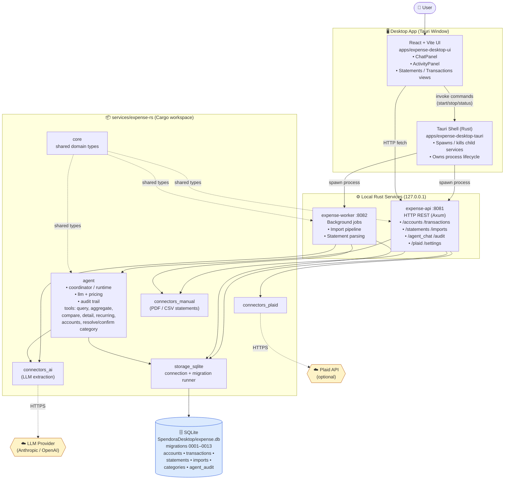

# Spendora — Architecture Overview

A desktop-first personal expense tracker. The app is **local-first**: UI, API, worker, and database all run on the user's machine. Outbound network calls are limited to optional Plaid sync and the LLM provider used by the agent.

## Architecture Diagram

## Key Talking Points

1. **Local-first desktop app** — not a typical client/server SaaS. Everything (UI, API, DB) runs on the user's machine.
2. **Three-layer process model:**
   - **Tauri shell** (native window + process supervisor)
   - **React UI** (rendered inside Tauri)
   - **Two Rust services** (`expense-api` on `:8081`, `expense-worker` on `:8082`) spawned as child processes.
3. **Shared SQLite DB** (`expense.db`) — schema evolves via versioned migrations (`0001` … `0013`).
4. **Rust workspace = modular crates:** `core` (domain), `storage_sqlite` (persistence), `connectors_*` (Plaid / manual PDF / AI extraction), and `agent` (LLM-driven assistant with its own tools + audit trail).
5. **Agent subsystem** is the "intelligence layer": a coordinator + tools (`query`, `aggregate`, `compare`, `recurring`, `resolve_category`, etc.) call an external LLM, persist every turn into an audit table, and surface it in the UI's Activity tab.
6. **External calls are minimal & optional** — only outbound HTTPS to Plaid (bank sync) and the LLM provider; no Spendora-owned backend.

## Repo Layout (Quick Reference)

| Path | Purpose |
|---|---|
| `apps/expense-desktop-ui` | React + Vite UI (renders inside Tauri window) |
| `apps/expense-desktop-tauri` | Tauri shell — owns child-process lifecycle |
| `services/expense-rs/crates/api` | Local HTTP API (`127.0.0.1:8081`) |
| `services/expense-rs/crates/worker` | Background worker (`127.0.0.1:8082`) |
| `services/expense-rs/crates/storage_sqlite` | DB connection + migration runner |
| `services/expense-rs/crates/core` | Shared domain types |
| `services/expense-rs/crates/agent` | LLM agent: coordinator, runtime, tools, audit |
| `services/expense-rs/crates/connectors_plaid` | Plaid integration |
| `services/expense-rs/crates/connectors_manual` | Manual PDF/CSV statement import |
| `services/expense-rs/crates/connectors_ai` | LLM-based extraction |
| `services/expense-rs/migrations` | Versioned SQL migrations |
