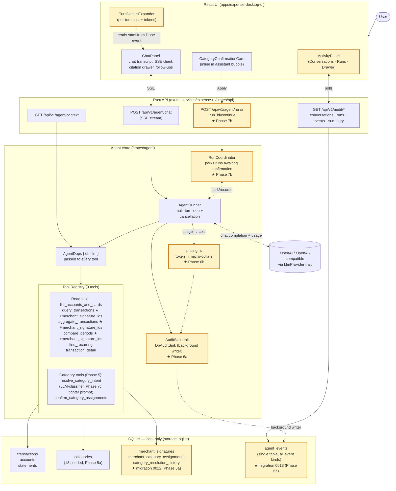
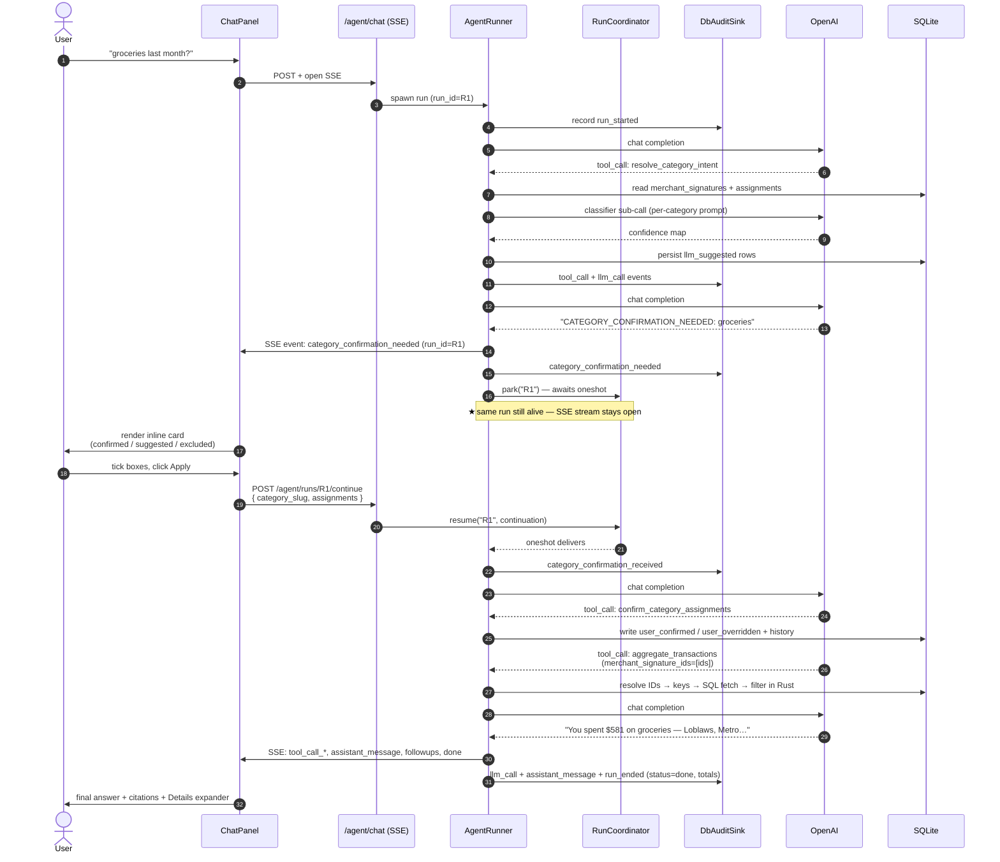

# Architecture — Agent Financial Awareness

State as of Phase 7 (shipped). This is the current shape of the system after Phases 1–7.

## System topology

★ = added or changed in Phases 5–7.

---

## End-to-end flow — "How much on groceries last month?"

This is the canonical category question. Shows how Phases 5, 6, and 7 collaborate in one run.

Key things this diagram makes visible:

- **One run.** `run_id=R1` is used start-to-finish. The Activity tab shows it as a single entry with one cost rollup.
- **`merchant_signature_ids`, not substrings.** The `aggregate_transactions` call (step 26) sends UUIDs that the server resolves to canonical merchant keys. No more `%uuid%` LIKE failures.
- **Audit runs in parallel.** Every event hits `DbAuditSink` → background tokio task → `agent_events` table. The hot path never blocks.
- **The Coordinator owns the pause.** Without `coordinator: Some(...)` on the runner the sentinel still works the old way (used by tests).

---

## Failure modes the architecture handles

| Scenario | Handling |
|---|---|
| User closes tab during pause | SSE channel close → runtime detects via `events.closed()` → `coord.cancel()` → `run_ended` (status=cancelled) |
| User never clicks Apply | 5-min timeout in the runtime's `tokio::select!` → `coord.cancel()` → Truncated event + `run_ended` (status=abandoned) |
| Double-click Apply | First POST consumes the oneshot → second POST gets 409 Conflict; UI surfaces error inside card |
| Audit DB write fails | `DbAuditSink` logs `tracing::warn`, drops the event. Run continues. |
| LLM provider misconfigured | `/agent/chat` returns 503 with actionable message at handler level |
| LLM returns malformed JSON in classifier | `parse_classifier_json` extracts the JSON block from prose/fences; on failure tool returns an error the agent reads as a Tool message and can retry |
| Empty data window | Tools return `window_has_any_data: false`; system prompt requires the agent to say so explicitly (Phase 7c) |

---

## What ships per phase

| Phase | What appeared in this diagram |
|---|---|
| 1–4 | Runtime, LlmProvider, ReadTools, basic UI |
| 5a | `merchant_signatures` + `merchant_category_assignments` + `category_resolution_history` |
| 5b | `AgentDeps` (the box that lets tools call the LLM) |
| 5c | `resolve_category_intent` tool with classifier sub-call |
| 5d | `confirm_category_assignments` + `merchant_substrings` array |
| 5e | `CategoryConfirmationCard` in UI |
| 6a | `AuditSink` trait + `DbAuditSink` background writer + `agent_events` table |
| 6b | `pricing.rs` for token → cost |
| 6c | Runtime instrumentation: every event recorded |
| 6d | `/audit/*` endpoints |
| 6e | `TurnDetailsExpander` per-turn UI |
| 6f | `ActivityPanel` cross-conversation UI |
| 7a | `merchant_signature_ids` filter on `query` / `aggregate` / `compare` |
| 7b | `RunCoordinator` + `POST /agent/runs/:id/continue` + runtime park/resume |
| 7c | Tighter classifier prompt + per-category exclusion rules |
| 7d | UI Apply hits `/continue` (no JSON message in chat) |
| 7e | Abandoned-run test + smoke for `/continue` endpoint |

---

## What is NOT in this diagram (deferred)

- Custom user-defined categories
- Subcategories
- Splitting a single merchant across multiple categories
- Auto-categorisation on import (today: lazy via chat)
- Persistent chat history in SQLite (today: localStorage, capped at 100 turns)
- Real LLM-token streaming (today: full responses emitted at once; tool chips show progress mid-loop)
- WebSocket transport (SSE + separate POST coordination is sufficient at our scale)
