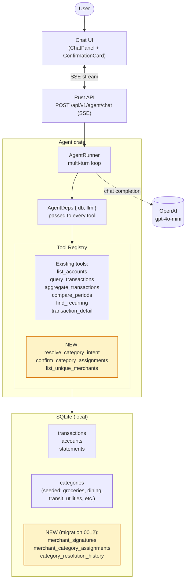

# Architecture — where the new layer plugs in

The agent runtime stays the same. We add 3 new tools and 3 new SQLite tables (highlighted in yellow).

## What's changing

- **Tool trait refactor**: every tool now receives `AgentDeps { db, llm }` instead of just `&SqlitePool`. This lets new tools call the LLM for classification.
- **3 new tools** that together implement the learning loop.
- **3 new tables** for merchant signatures, current category assignments, and an audit history for future learning.

## What's NOT changing

- The SSE event protocol stays the same shape, with one new event kind: `category_confirmation_needed`.
- Existing tools work exactly as before after the trait refactor.
- No changes to the transactions, accounts, or statements tables.
