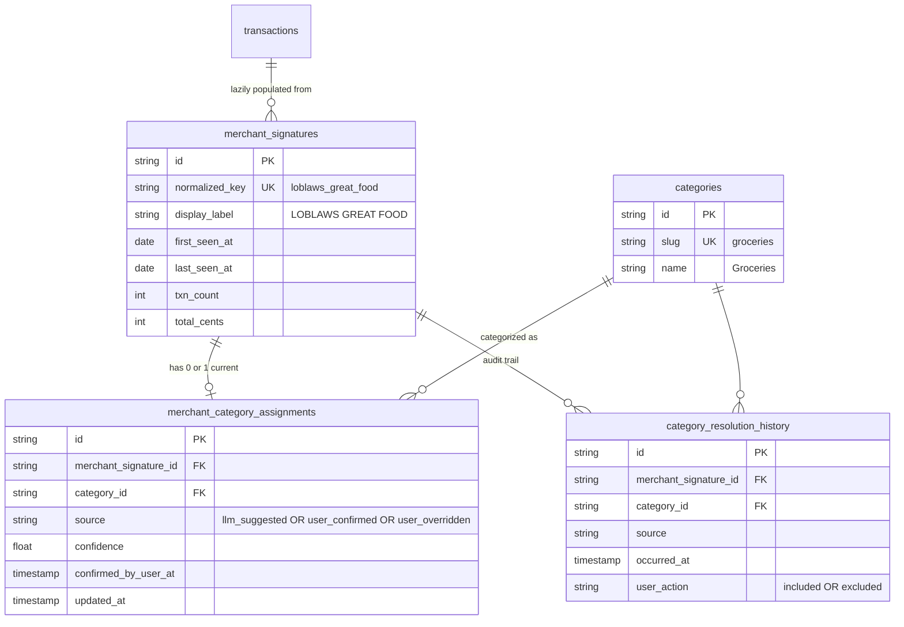

# Data Model — new tables for migration 0012

Three new tables. One existing table (`categories`) is seeded.

## Why each table exists

### `merchant_signatures`
Deduplicates raw merchant strings (`LOBLAWS #1234 TORONTO`, `LOBLAWS WESTON`, `LOBLAWS GREAT FOOD`) by normalizing them into one canonical key. Avoids re-classifying the same merchant under different statement formattings.

### `merchant_category_assignments`
The **current** category for each merchant. `UNIQUE(merchant_signature_id)` means each merchant has exactly one active category at a time. The `source` column tells us who decided:

| Source | Meaning |
|---|---|
| `llm_suggested` | Agent guess, awaiting user confirmation |
| `user_confirmed` | User explicitly approved the LLM's suggestion |
| `user_overridden` | User changed it (e.g. "Walmart is shopping, not groceries") |

A `user_overridden` row will never be re-suggested by the LLM. The system trusts the user permanently.

### `category_resolution_history`
Append-only audit log. **Today** it's dead weight. **Tomorrow** it's training data:

- "User overrode Walmart 4 times across 4 sessions → maybe our default suggestion is wrong"
- "User confirmed every Costco-as-groceries suggestion → boost confidence"
- "Build a per-user classifier from their own confirmation patterns"

Costs ~64 bytes per row. Worth keeping.

### `categories` (seeded, not new)

Seed list (hardcoded in migration 0012):

| slug | name |
|---|---|
| `groceries` | Groceries |
| `dining` | Dining & Restaurants |
| `transit` | Transit & Fuel |
| `utilities` | Utilities & Bills |
| `entertainment` | Entertainment |
| `shopping` | Shopping |
| `subscriptions` | Subscriptions |
| `healthcare` | Healthcare |
| `travel` | Travel |
| `income` | Income |
| `transfers` | Transfers |
| `fees` | Fees & Interest |
| `other` | Other |

Custom user-defined categories deferred — would require a UI and merge logic.
