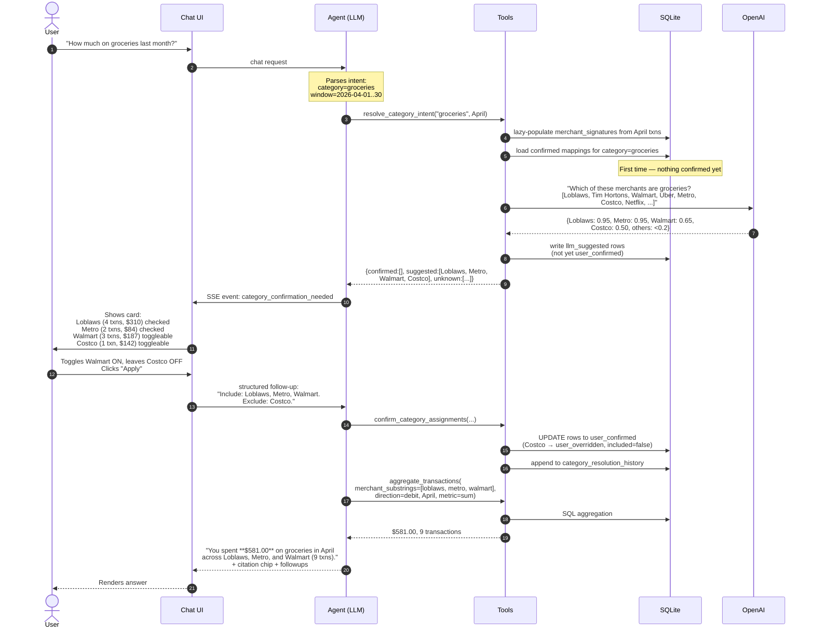

# Flow — First time asking about a category (learning happens)

When the user asks about "groceries" for the first time, the system has nothing learned. It asks the LLM to suggest, then asks the user to confirm. The user's confirmation is persisted.

## Key moments

| Step | What's happening |
|---|---|
| 5 | Only unclassified merchants are sent to the LLM — we don't re-ask about merchants already in the assignments table. |
| 6 | LLM returns confidence scores. We don't show low-confidence ones (< 0.2) to the user. |
| 7 | Even before the user confirms, we store the LLM's guesses with `source='llm_suggested'`. Lets us mine these later or show suggestions faster next time. |
| 9 | The confirmation card is rendered **inside** the assistant message bubble — not a modal — so it feels like part of the conversation. |
| 12 | User overrides (Costco → not groceries) are first-class. Stored as `user_overridden`, never re-suggested. |
| 13 | The audit log captures every confirmation/override so we can train better classifiers later. |
| 14 | The actual aggregation happens with the user's final list. This is what produces the citation chips. |
