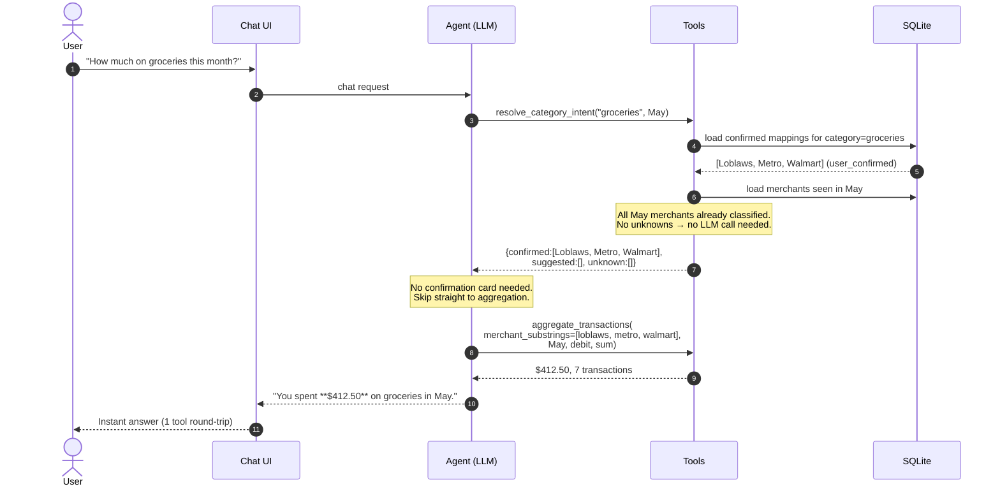
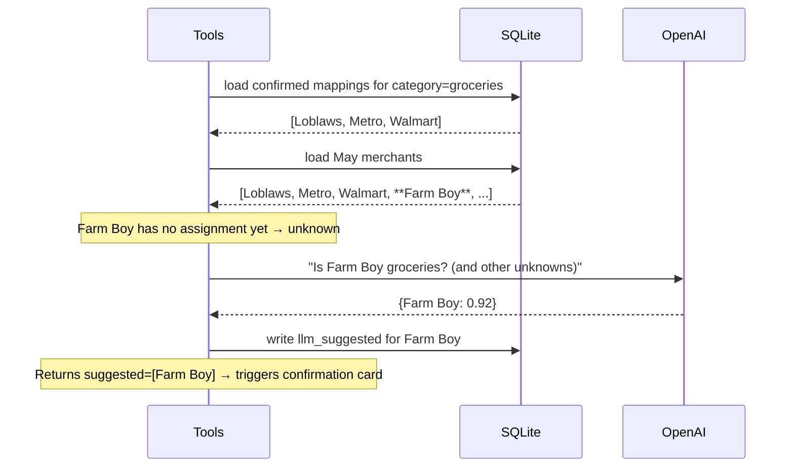

# Flow — After the category is learned (silent path)

The second time the user asks about "groceries", no LLM classification is needed and no confirmation is shown. The agent goes straight to the answer.

## What makes this fast

- **No LLM classification call** — every merchant in May was already classified from prior interactions.
- **No user confirmation card** — `suggested` is empty, so the agent skips it.
- **Just 1 aggregate query** — same as a non-category question.

## What happens if a NEW merchant appears in May

Example: user used a new grocery store in May called "Farm Boy".

So you only get re-prompted for *truly new* merchants. The system stabilizes quickly.
