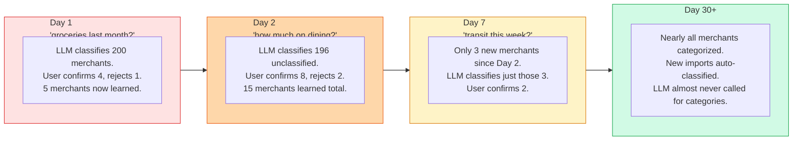
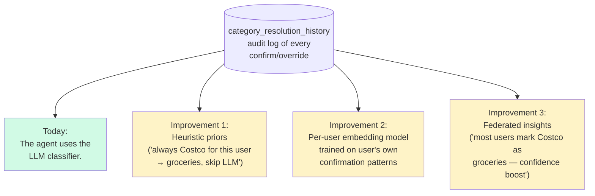

# Learning over time — how the system gets smarter

Each interaction reduces the number of merchants the LLM has to classify next time. After a couple weeks of use, the LLM is rarely called.

## What this means economically

- Day 1: ~$0.005 per category question (one LLM classification call)
- Day 30+: ~$0.000 per category question (no classification needed)

The cost asymptotes to zero as the user's merchant pool stabilizes.

## What this means for accuracy

- Day 1: accuracy depends on the LLM's world knowledge and the user spotting misses
- Day 30+: accuracy is whatever the user confirmed it to be. The system can't drift.

## Future improvements unlocked by `category_resolution_history`

All three improvements drop in **without changing the tool API** (`resolve_category_intent` keeps the same input/output). They just change *how* the suggestions are computed. That's the value of the trait + table abstraction.
