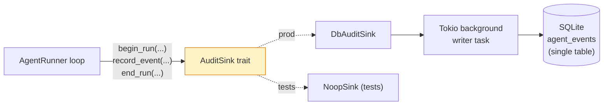

# Phase 6 — Audit Trail Subsystem

Date: 2026-05-15 (shipped 2026-05-15)
Status: ✅ Shipped (6a–6g)
Estimate: ~7 hours across 7 sub-phases

A persistent, queryable record of everything the agent system does — every chat run, every LLM call (with full prompts + responses), every tool call, every mutation, every error. Local-only, written to the same SQLite DB.

## Locked product decisions

| Question | Answer |
|---|---|
| Scope | Agent system only — runs, tool calls, LLM calls, category writes |
| LLM prompt storage | **Full prompts + responses persisted.** ~4–20 KB per turn. Lives on local disk. |
| UI surface | Per-turn "Details" expander in chat **and** a dedicated Activity tab |
| Cost tracking | **Yes**, with a hardcoded price table for known models |

## What gets audited

Every event below is persisted with a strict ordering (`sequence` int per run) so the run can be replayed exactly:

| Event kind | Payload |
|---|---|
| `run_started` | user message, system prompt hash, history turn count, provider, model |
| `llm_call` | request messages (full), response message, finish_reason, prompt_tokens, completion_tokens, latency_ms, cost_micros |
| `tool_call` | tool name, arguments, summary, ok/fail, txn_ids, raw data (size-capped), duration_ms |
| `assistant_message` | content emitted |
| `category_confirmation_needed` | slug, payload |
| `followups` | list |
| `truncated` | reason |
| `error` | message |
| `run_ended` | iterations, total_tokens, total_cost_micros, status (`done`/`error`/`truncated`/`cancelled`) |

Cost in **micro-dollars** (integer) for precision — no float drift.

## Data model — single events table

Audit logs are event streams, not relational entities. One table holds every event; conversations and runs are *defined by* `event_kind` filters and `(conversation_id, run_id)` grouping.

```sql
-- migration 0013_agent_audit.sql
CREATE TABLE agent_events (
  id TEXT PRIMARY KEY,
  conversation_id TEXT NOT NULL,        -- denormalized on every row
  run_id TEXT NOT NULL,                 -- denormalized on every row
  sequence INTEGER NOT NULL,            -- 0-based, monotonic within a run
  event_kind TEXT NOT NULL,             -- see event list below
  occurred_at TEXT NOT NULL DEFAULT CURRENT_TIMESTAMP,
  duration_ms INTEGER,                  -- llm_call / tool_call only
  payload_json TEXT NOT NULL,           -- full event details, gzip+base64 if >4 KB

  -- Promoted-to-column fields for fast filtering / rollup (NULL when N/A):
  status TEXT,                          -- 'running' | 'done' | 'error' | 'truncated' | 'cancelled' — set on run_started + run_ended
  model TEXT,                           -- llm_call + run_started
  prompt_tokens INTEGER,                -- llm_call (and totalled on run_ended)
  completion_tokens INTEGER,            -- llm_call (and totalled on run_ended)
  cost_micros INTEGER,                  -- llm_call (and totalled on run_ended)
  user_message_excerpt TEXT,            -- run_started only (first 200 chars)
  tool_name TEXT,                       -- tool_call only
  ok INTEGER,                           -- tool_call only (0/1)
  error_message TEXT                    -- error / failed run_ended
);

CREATE INDEX idx_agent_events_conv_time ON agent_events(conversation_id, occurred_at);
CREATE INDEX idx_agent_events_run_seq   ON agent_events(run_id, sequence);
CREATE INDEX idx_agent_events_kind_time ON agent_events(event_kind, occurred_at);
```

### Why 1 table

- One INSERT path — no cross-table consistency concerns
- Append-only matches the mental model
- Adding a new event kind = zero schema change
- Promoted columns make rollups fast; full detail still lives in `payload_json`
- Replay is `SELECT * FROM agent_events WHERE run_id=? ORDER BY sequence`

### Conversations and runs as queries

```sql
-- List of conversations (most recent first), with rollups:
SELECT
  conversation_id,
  MIN(occurred_at) AS started_at,
  MAX(occurred_at) AS last_active_at,
  COUNT(DISTINCT run_id) AS run_count,
  SUM(CASE WHEN event_kind='llm_call' THEN cost_micros ELSE 0 END) AS total_cost_micros,
  SUM(CASE WHEN event_kind='llm_call' THEN prompt_tokens ELSE 0 END) AS prompt_tokens,
  SUM(CASE WHEN event_kind='llm_call' THEN completion_tokens ELSE 0 END) AS completion_tokens,
  MAX(CASE WHEN event_kind='run_started' THEN user_message_excerpt END) AS first_question
FROM agent_events
GROUP BY conversation_id
ORDER BY last_active_at DESC
LIMIT 50;

-- Per-conversation cost (answers "how much did this chat session cost?"):
SELECT SUM(cost_micros) / 1000000.0 AS dollars
FROM agent_events
WHERE conversation_id = ?1 AND event_kind = 'llm_call';

-- Activity tab — completed runs at a glance (run_ended rows carry totals):
SELECT id, conversation_id, run_id, occurred_at, status,
       model, prompt_tokens, completion_tokens, cost_micros, error_message
FROM agent_events
WHERE event_kind = 'run_ended'
ORDER BY occurred_at DESC
LIMIT 100;

-- Total cost in the last 7 days:
SELECT SUM(cost_micros) / 1000000.0 AS dollars
FROM agent_events
WHERE event_kind = 'llm_call' AND occurred_at >= date('now', '-7 days');
```

All of these are O(index-scan) at SQLite scale (we're talking thousands of events per month max for a single user).

## Architecture



**Key design choice — background writer:** the audit sink hands events to a buffered tokio channel; a background task flushes to SQLite. This way audit writes never block the SSE stream. On crash we lose at most a few in-flight events (acceptable for v1 — `run_ended` is the last write and is flushed before returning).

**LLM provider extension:** `ChatCompletionResponse` gains an optional `usage: TokenUsage { prompt, completion }`. OpenAI returns this natively; local providers may not — falls back to None.

**Cost calc:** static table keyed by `model_label`:
```rust
const PRICING: &[(model, input_per_1m_micros, output_per_1m_micros)] = &[
    ("openai:gpt-4o-mini", 150,  600),
    ("openai:gpt-4o",     2_500, 10_000),
    // …
];
```
Env override: `AGENT_PRICING_OVERRIDE=model=in,out;…` for unknown models.

## Sub-phases

| | Sub-phase | Status | Commit |
|---|---|---|---|
| 6a | Migration 0013, storage helpers, `AuditSink` trait, `NoopSink`, `DbAuditSink` with background writer | ✅ | `1cf9f24` |
| 6b | `LlmProvider`: extract `usage` from OpenAI response; cost calculator with model price table | ✅ | `67271f2` |
| 6c | Wire `AgentRunner` to call `sink.record(...)` at every event; capture full LLM payloads | ✅ | `c49c128` |
| 6d | API endpoints: conversations, runs, run events, summary | ✅ | `b1107dc` |
| 6e | UI "Details" expander per assistant turn + stable conversation_id | ✅ | `cd0e73d` |
| 6f | UI Activity tab — Conversations / Runs views + run drawer | ✅ | `c8f201a` |
| 6g | Smoke script extension + README update | ✅ | (this commit) |

## Build order

Strict sequence 6a → 6b → 6c (server-side foundations). 6d ≈ 6e ≈ 6f can interleave but ordered makes for cleaner commits. 6g at the end.

## Tests

- Storage helpers: round-trip writes + reads, 9 tests
- Audit sink: NoopSink no-ops cleanly; DbAuditSink writes in correct order; survives sink errors without breaking the run
- Cost calculator: known model returns correct micros; unknown model returns 0 + warning
- LLM provider: parses OpenAI `usage` correctly; absent in local responses doesn't break

## Validation gates

- [ ] `cargo test --workspace` green (target: 65+ agent tests after this lands)
- [ ] `cargo clippy -p agent -p api --all-targets` clean
- [ ] `npm run test:ui-build` clean
- [ ] Manual: ask a question → click Details → see model/tokens/cost/tool calls in expander
- [ ] Manual: open Activity tab → see prior runs, filter by status=error
- [ ] Manual: kill the API mid-stream → audit run row marked `cancelled`/`error`, last `run_ended` event present
- [ ] Per-session cost visible in the Activity tab's Conversations view
- [ ] DB inspection: `SELECT SUM(cost_micros)/1000000.0 FROM agent_events WHERE event_kind='llm_call' AND occurred_at >= date('now','-7 days')` returns a sensible dollar figure

## Risks & mitigations

| Risk | Mitigation |
|---|---|
| Audit DB writes block the hot path | Background tokio writer; channel-buffered. Sink methods return immediately. |
| Audit failures break the run | Sink errors are logged via `tracing::warn` but never propagated. Audit is best-effort. |
| Full LLM payloads bloat DB | Per-row payload cap at 64 KB. Anything over that gets gzipped (zlib) and stored as base64. |
| Tests break because they all instantiate AgentRunner | `NoopSink` is the default for `AgentRunner::new`; only the wired API path uses `DbAuditSink`. No test changes needed. |
| Token usage missing on local providers | `usage` is `Option`. Cost = 0 if missing. Surface "(token usage unavailable)" in UI. |
| Schema drift if we add models later | `model` column is a free-form string; pricing is env-overridable. |
| Privacy — full prompts include account names and merchants | Documented in README. User can drop the DB at any time. Future feature: redact-on-export. |

## Deferred

- Vacuum / retention policy (today: keep forever; user can `DELETE` manually)
- Export to JSON/CSV
- Audit of non-agent code paths (imports, statement edits, manual transactions)
- Tamper-evidence (hash chaining of events)
- Cross-conversation analytics (e.g. "most asked categories", "tool-call frequency heatmap")
- Cost alerts / budgets
- Replay tool (re-run an audited run against a fixture)

## Architecture cross-links

- Builds on the existing `category_resolution_history` table from migration 0012 — that table stays (it's per-merchant grained for ML purposes); `agent_events` is per-event grained for replay/debugging.
- Reuses `LlmProvider` + `AgentDeps` plumbing from Phase 5b. No trait changes needed beyond the response-side `usage` field.
- `audit_events` (migration 0001) stays unused for now. v2 may funnel coarse rollups into it.

---

**Approve and I'll start with 6a (migration + AuditSink trait).** Or push back on anything in the data model, the background-writer choice, or the sub-phase split.
